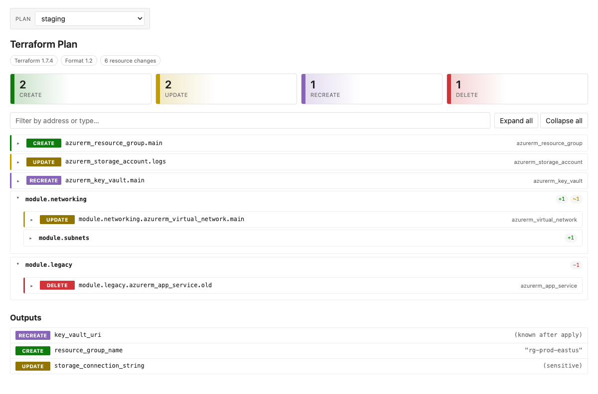
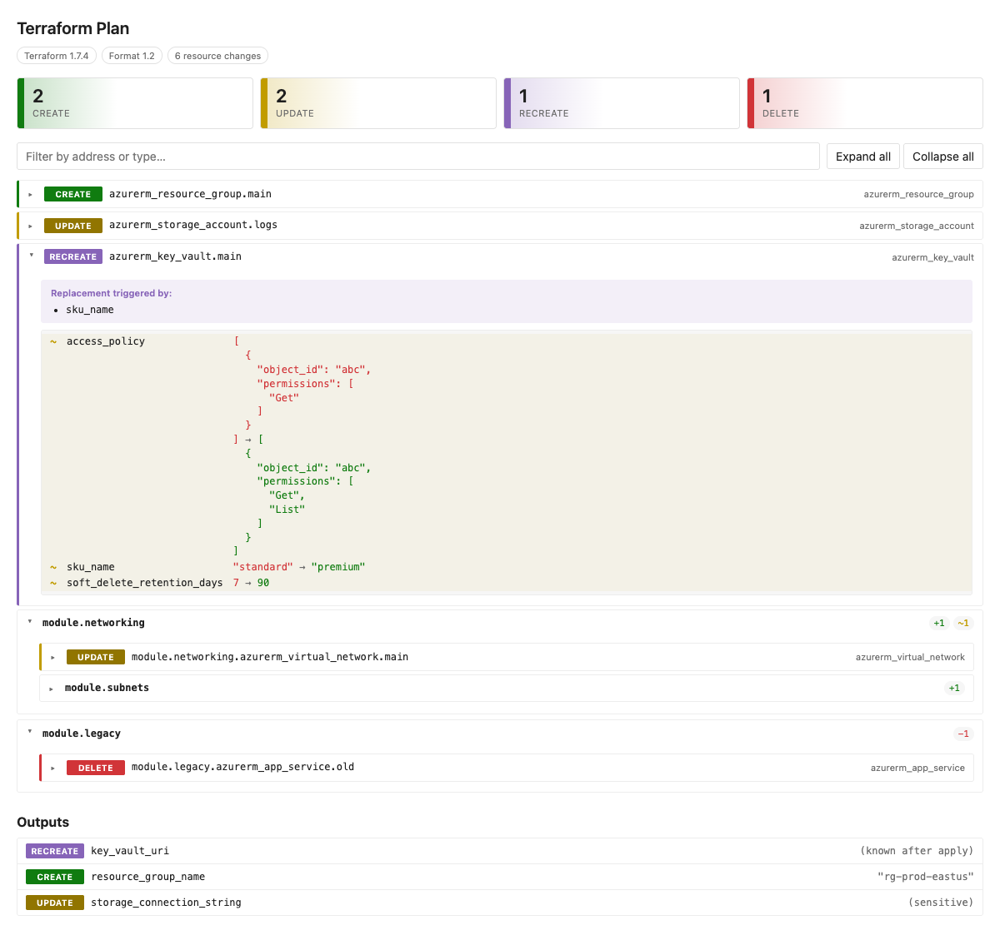

# Azure DevOps Terraform Plan Viewer

[](https://marketplace.visualstudio.com/items?itemName=WayneGoosen.terraform-plan-viewer)
[](https://github.com/WayneGoosen/azdo-tf-plan-viewer/actions/workflows/main.yml)
[](LICENSE)

> Read your Terraform plans like code reviews, not CLI dumps.

A native **Plan Review** tab for Azure DevOps build summaries. Renders `terraform plan` output as a structured, searchable diff — module tree, attribute-level before → after, replace reasons, multi-stage selector — instead of dumping it as text into the build log.



---

## Why this exists

Most Azure DevOps pipelines do one of two things with a Terraform plan:

- **Dump it as text** into the build log. Reviewing means scrolling through thousands of ANSI-coded lines and hoping `Ctrl+F` finds what matters.
- **Generate a static HTML report** at pipeline time. Locked to one theme, can't be filtered, can't be searched, and goes stale the moment requirements shift.

Neither is built for the moment that matters: a human deciding whether the change is safe to apply. This extension treats the plan as **structured data**, not text — so the tab can do everything a code reviewer needs.

## What you get

- **Module-grouped tree.** Resources nest by their `module_address` (`module.networking.module.subnets`). Each module shows rolled-up counts: `+1 ~1 −1`.
- **Attribute-level diffs.** Expand any resource to see exactly which keys changed, **before → after**, with `+ – ~` markers. Sensitive values render as `(sensitive)`. Computed values render as `(known after apply)`.
- **Replace reasons.** For `[delete, create]` resources, the tab surfaces the plan's `replace_paths` — answering *"why is this being recreated?"* with one line instead of guesswork.
- **Click-to-filter summary.** Four cards at the top — Create / Update / Recreate / Delete — each clickable. Combine with a search box across resource addresses and types.
- **Multi-stage selector.** Publish multiple plans per build (dev / staging / prod) and switch between them in a dropdown. The selector hides when only one plan is attached, so single-plan UX stays unchanged.
- **Outputs section.** Output changes are rendered separately so downstream consumers don't get blindsided by a removed `connection_string`.
- **Native ADO theming.** Colours use ADO theme tokens — light, dark, and high-contrast modes all work without extra config. Monospace is Cascadia Mono (no programming ligatures), so literal attribute values like `!=` and `->` render as written.



## Quick start

```yaml
- task: TerraformInstaller@0
  inputs:
    terraformVersion: 'latest'

- task: Bash@3
  displayName: 'Terraform Plan'
  inputs:
    targetType: 'inline'
    script: |
      terraform init
      terraform plan -out=tfplan

- task: TerraformPlanViewer@1
  displayName: 'Publish Terraform Plan'
  inputs:
    planPath: '$(System.DefaultWorkingDirectory)/tfplan'
```

After the pipeline runs, open the build and click the **Plan Review** tab.

The task accepts either form of plan:

- The **binary plan** from `terraform plan -out=tfplan` — the task converts it via `terraform show -json` automatically.
- The **JSON form** from `terraform show -json tfplan > tfplan.json` — useful if `terraform` isn't on the publishing agent.

## Multi-stage example

Call the task once per stage with distinct `attachmentName` values:

```yaml
- task: TerraformPlanViewer@1
  displayName: 'Publish dev plan'
  inputs:
    planPath: '$(System.DefaultWorkingDirectory)/dev/tfplan'
    attachmentName: 'dev'

- task: TerraformPlanViewer@1
  displayName: 'Publish prod plan'
  inputs:
    planPath: '$(System.DefaultWorkingDirectory)/prod/tfplan'
    attachmentName: 'prod'
```

Each `attachmentName` becomes a label in the dropdown. Sorted alphabetically, the first is selected by default.

## Task inputs

| Input | Required | Description | Default |
|---|---|---|---|
| `planPath` | Yes | Path to a Terraform plan — binary (`terraform plan -out=…`) or JSON (`terraform show -json`). Binary plans are converted on the agent. | – |
| `attachmentName` | No | Identifier for the attachment; used as the label in the tab's plan selector. | `terraform-plan` |

## How it works

The task uploads the plan JSON as a build attachment under the type `terraform-plan-viewer.plan`. The tab fetches the attachment via Azure DevOps's Build REST API, parses it client-side, and renders the diff entirely in the browser. No server, no database, no third-party endpoint — plan data sits in your Azure DevOps organization the same way build logs do.

## Privacy & security

- **No third-party calls.** Plan JSON stays in your Azure DevOps organization. Nothing leaves your tenant.
- **Sensitive values are masked.** Anything Terraform marks `sensitive` (`before_sensitive` / `after_sensitive`) renders as `(sensitive)` — the underlying value never reaches the DOM.
- **DOM-safe rendering.** Plan content goes through `textContent` / `createElement`, never as an HTML string — so a malicious resource address can't inject script.

## Local development

```bash
npm install
npm run build      # full build: task + tab + package
npm run dev        # local dev harness — sample plans in dev-fixtures/
```

The dev harness drives the production `renderPlans()` path with mock attachments backed by fixture files, so you can iterate on the tab without an ADO build. `?slow=15000` (query string) makes the loading state visible long enough to inspect; `?single=1` exercises the single-plan code path.

For end-to-end testing inside a real Azure DevOps organization, see [TESTING.md](TESTING.md).

## Releasing

CI handles build, version calculation, and marketplace publishing. The full setup (`ADO_PUBLISHER_PAT` secret, GitVersion anchoring, day-to-day release flow) is documented in **[.github/RELEASING.md](.github/RELEASING.md)**.

The version is **calculated automatically from commit messages**:

| Commit prefix or footer | Bump |
|---|---|
| `feat:` (or `feat(scope):`) | minor |
| `fix:` (or `fix(scope):`) | patch |
| `+semver: skip` (footer) | no bump |
| `+semver: minor` / `+semver: major` (footer) | explicit override |
| anything else | patch (default) |

## License

MIT — see [LICENSE](LICENSE).
